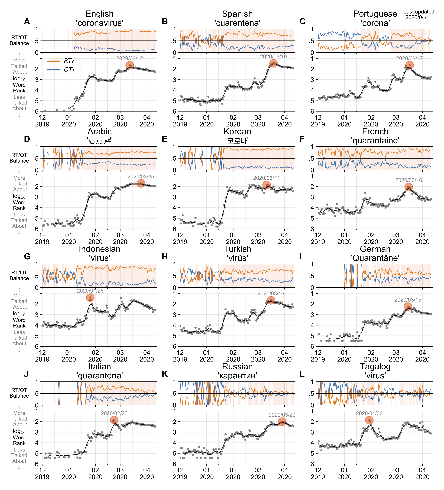
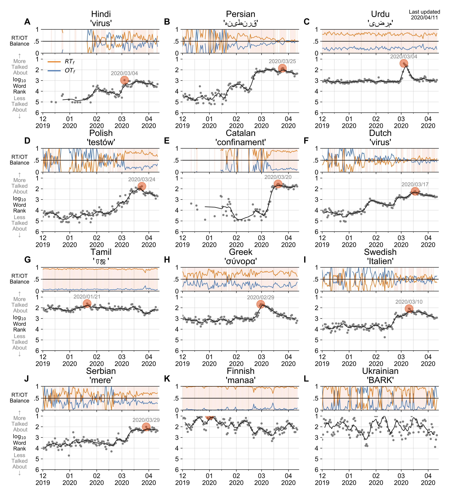

# COVID19 related n-gram time series for 24 languages on Twitter

### [[website](http://compstorylab.org/covid19ngrams/)] [[arXiv](http://pdodds.w3.uvm.edu/permanent-share/covid19-ngrams-revtex4.pdf)]

In confronting the global spread of the coronavirus disease COVID-19 pandemic 
we must have coordinated medical, operational, and political responses.

In all efforts, data is crucial. 
Fundamentally, and in the possible absence of a vaccine for 12 to 18 months, 
we need universal, well-documented testing for both the presence of the disease 
as well as confirmed recovery through serological tests for antibodies, 
and we need to track major socioeconomic indices.

But we also need auxiliary data of all kinds, 
including data related to how populations are talking about 
the unfolding pandemic through news and stories.

To in part help on the social media side, we curate a set of 1000 day-scale 
time series of 1-grams across [24 languages](data/languages.csv) 
on Twitter that are most 'important' 
for March 2020 with respect to March 2019. 
We determine importance through our 
[allotaxonometric instrument](https://arxiv.org/abs/2002.09770), 
rank-turbulence divergence.

We make some basic observations about some of the time series, 
including a comparison to numbers of confirmed deaths due to COVID-19 over time.

We broadly observe across all languages a peak for the language-specific word for 'virus' 
in January followed by a decline through February and a recent surge through March. 
The world's collective attention dropped away while the virus spread out from China.

Our main intent is for other researchers to use these time series 
to enhance whatever analyses that may be of use during the pandemic 
as well as for retrospective investigations.

\

## Data Format
We host the time series [here](data/timeseries), 
updating them on a daily basis while relevant.
Besides analyzing all tweets (AT), 
we also separately process what we call organic tweets (OT):
All Twitter messages which are original.
Organic tweets exclude retweets while including 
all added text for quote tweets
(see [our work](https://arxiv.org/abs/2003.03667) for technical details). 
In doing so, we are able to carry through a measure 
of spreadability for all n-grams.
The key threshold we use for spreading is the naive one from 
biological andsocial contagion models: 
When a 1-gram appears in more retweeted than organic material,
we view it as being socially amplified.

For each language, 
we export [6 **(T x N) matrices**](data/timeseries/1grams/English) 
where every row is a date index and every column is a unique 1gram
from the top 1000 1grams including:
- Number of occurrences [`count`, `count_no_rt`]
- Relative rate of usage [`freq`, `freq_no_rt`]
- Word rank [`rank`, `rank_no_rt`]

