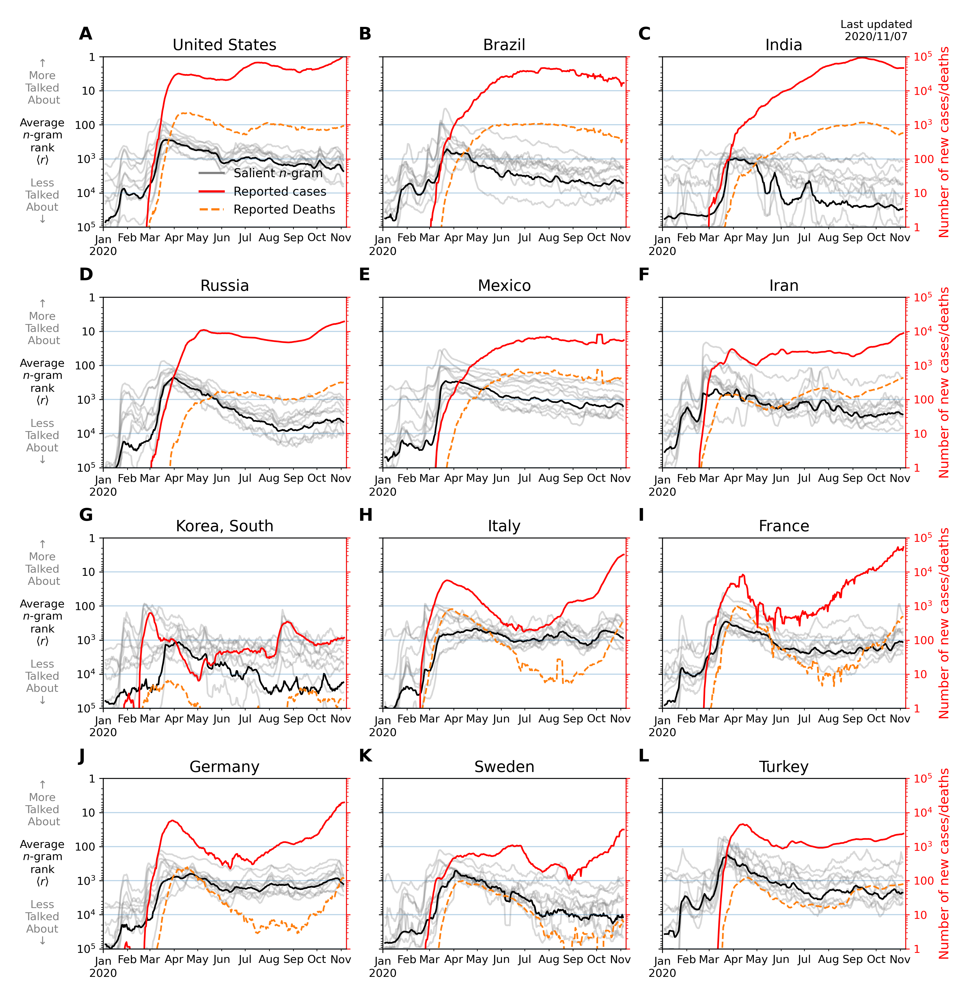

# COVID19 related n-gram time series for 24 languages on Twitter

- [Website](http://compstorylab.org/covid19ngrams/) 
- [arXiv](https://arxiv.org/abs/2003.12614)

In confronting the global spread of the coronavirus disease COVID-19 pandemic 
we must have coordinated medical, operational, and political responses.

In all efforts, data is crucial. 
Fundamentally, and in the possible absence of a vaccine for 12 to 18 months, 
we need universal, well-documented testing for both the presence of the disease 
as well as confirmed recovery through serological tests for antibodies, 
and we need to track major socioeconomic indices.

But we also need auxiliary data of all kinds, 
including data related to how populations are talking about 
the unfolding pandemic through news and stories.

To in part help on the social media side, we curate a set of 2000 day-scale 
time series of n-grams across [24 languages](languages.csv) 
on Twitter that are most 'important' 
for April 2020 with respect to April 2019. 
We determine importance through our 
[allotaxonometric instrument](https://arxiv.org/abs/2002.09770), 
rank-turbulence divergence.

We make some basic observations about some of the time series, 
including a comparison to numbers of confirmed deaths due to COVID-19 over time.

We broadly observe across all languages a peak for the language-specific word for 'virus' 
in January followed by a decline through February and a recent surge through March. 
The world's collective attention dropped away while the virus spread out from China.

Our main intent is for other researchers to use these time series 
to enhance whatever analyses that may be of use during the pandemic 
as well as for retrospective investigations.

## Data 

We share and maintain all data on an internal server. 
For each of the 24 languages, 
we provide time series for the top 1000 1-, and 2-grams for both all tweets (`AT`)
and organic tweets (`OT`). 
 
Note that in general, a 1-gram in the AT group may not appear in the OT group, 
as we start with only 10% of all tweets—a singular, highly retweeted tweet may contain 1-grams 
that are not produced organically by other users on that day 
(see [our work](https://arxiv.org/abs/2007.12988) for technical details).

We observe variations in punctuation and grammatical structures.
All of these non-pandemic-related elements may of course be filtered out
for individual languages by hand.
Nonetheless, we provide a `cleaned` version of the dataset whereby we filter out links, handles, punctuation marks, and emojis while keeping hashtags. 

We also note that our decision to respect capitalization is substantive, 
however, it consequently leads to new but overlapping n-grams 
to be included in our data.
Thus, we also share a `case_insensitive` version of our dataset 
to account for that. 

For each language, 
we export **(T x N)** matrices,
where every row is a date index and every column is a unique n-gram
from the top 1000 n-grams including:

- Absloute count [`count`, `count_no_rt`]
- Relative rate of usage [`freq`, `freq_no_rt`]
- Word rank [`rank`, `rank_no_rt`]


```
timeseries
├── raw
│   ├── april_top_1grams
│   ├── april_top_2grams
│   ├── april_case_insensitive_top_1grams
│   └── april_case_insensitive_top_2grams
└── cleaned
    ├── april_top_1grams
    ├── april_top_2grams
    ├── april_case_insensitive_top_1grams
    └── april_case_insensitive_top_2grams
        ├── Arabic
        ├── Catalan
        ├── Dutch
        ├── English
        │   ├── count_no_rt.tsv
        │   ├── count.tsv
        │   ├── freq_no_rt.tsv
        │   ├── freq.tsv
        │   ├── rank_no_rt.tsv
        │   └── rank.tsv
        ├── Finnish
        ├── French
        ├── German
        ├── Greek
        ├── Hindi
        ├── Indonesian
        ├── Italian
        ├── Korean
        ├── Persian
        ├── Polish
        ├── Portuguese
        ├── Russian
        ├── Serbian
        ├── Spanish
        ├── Swedish
        ├── Tagalog
        ├── Tamil
        ├── Turkish
        ├── Ukrainian
        └── Urdu
```

```bash
version="cleaned"
URL="https://storylab.w3.uvm.edu/share/data/covid19ngrams/data/timeseries/$version"
ngrams="april_top_1grams april_top_2grams april_case_insensitive_top_1grams april_case_insensitive_top_2grams"
languages="English French Portuguese Spanish German Arabic"
metrics="rank freq"
for n in $ngrams; do
    for lang in $languages; do
        mkdir -p "./$n/$lang"
        for f in $metrics; do
            curl "$URL/$n/$lang/$f.tsv" -o "$n/$lang/$f.tsv"
        done
    done
done
```
Feel free to run a similar bash script to retrieve the data from our server.


